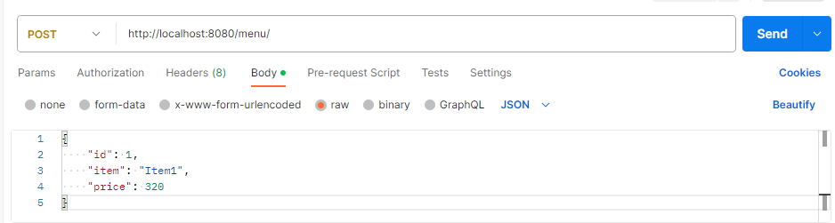
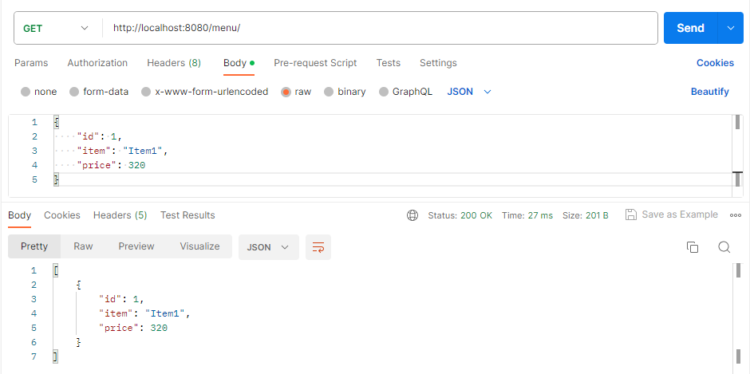
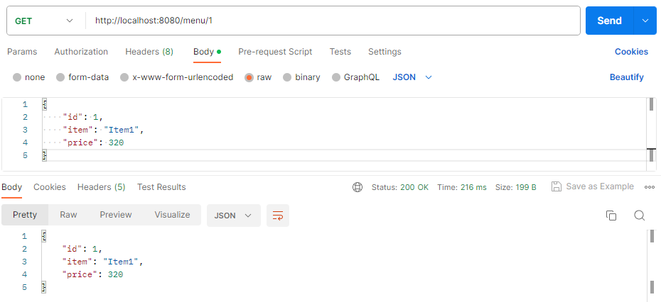
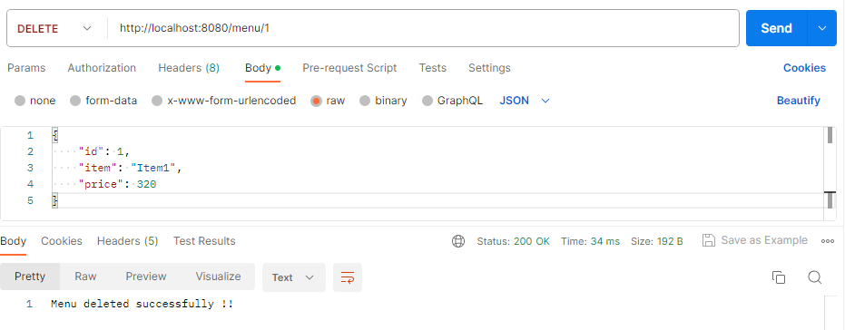

# Redis

SpringBoot redis application

In this Application we are using HashOperation.
We can manage redis hash values using the HashOperations helper class.

HashOperations have put(), get(), entries(), values, and delete etc. as basic hash map operations to operate with redis hash key values.

The Redis CACHE has also been configured, which will be used to store cached information for the defined time in the RedisCacheManagerBuilderCustomizer BEAN.
This configuration is not currently being utilized but was set up for the purpose of study and functions as follows:
Once the CACHE time has been defined, this BEAN can be used within a method to store result information.
For example, the code below performs a query for all information in the Redis database. However, this will only be executed once because subsequent requests to this 
method will retrieve information from the CACHE. The CACHE duration was set to 5 minutes in the BeanConfiguration. After these 5 minutes, a new query will be executed in the database and stored in the CACHE.
<pre>
@Cacheable(value = "itemCache")
public Item retrieveAllInformation(String id) {
    return menuRepo.findAll();
}
</pre>

To run application, execute the following steps.
1. Run docker file in application root directory.
> docker-compose up -d
2. Start the Spring Boot Application running main class.

3. Save(POST) item in Redis database.

4. (GET) all data from Redis database.

5. (GET) data by ID from Redis database.

6. (DELETE) data by ID from Redis database.

